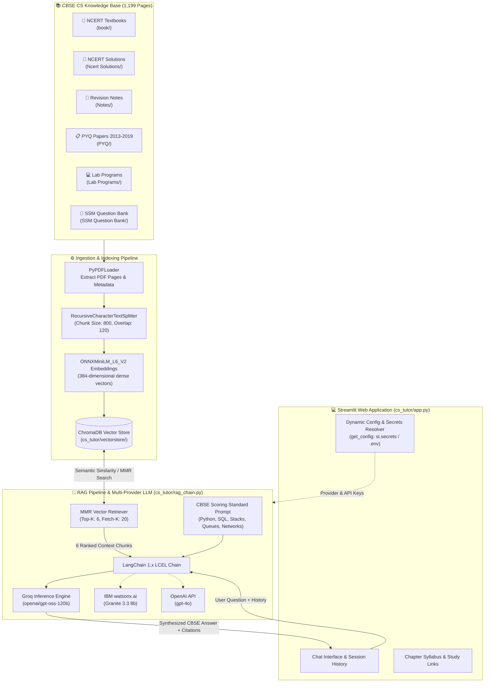
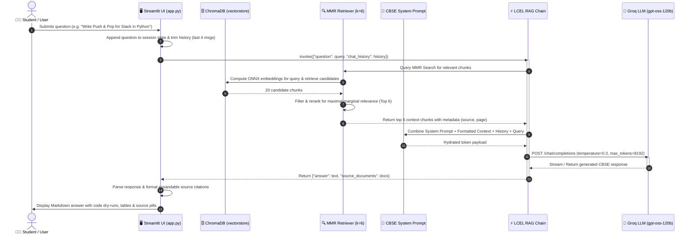
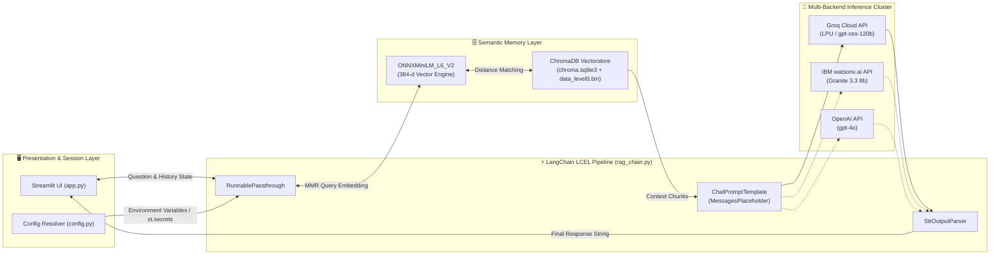

# 🏛️ CBSE Class 12 Computer Science AI Tutor — System Architecture & RAG Pipeline Documentation

This document provides a comprehensive technical breakdown of the **CS RAG Project** architecture, its offline document ingestion lifecycle, the online Retrieval-Augmented Generation (RAG) execution flow, and a complete catalog of all AI tools, models, frameworks, and their interconnections.

---

## 1. High-Level System Architecture

The CS AI Tutor follows a decoupled, cloud-resilient RAG architecture designed for CBSE Class 12 Computer Science (Python 083) curriculum. It consists of three primary subsystems:
1. **Offline Ingestion & Embedding Pipeline** ([`cs_tutor/ingest.py`](cs_tutor/ingest.py:1))
2. **Persistent Vector Database & Semantic Index** ([`cs_tutor/vectorstore/`](cs_tutor/vectorstore/))
3. **Conversational LCEL Retrieval & Generation Engine** ([`cs_tutor/rag_chain.py`](cs_tutor/rag_chain.py:1), [`cs_tutor/app.py`](cs_tutor/app.py:1))



---

## 2. End-to-End RAG Execution Flow Diagram

The diagram below details the operational execution lifecycle when a student asks a question in the Streamlit UI.



---

## 3. Detailed Data Flow & Processing Stages

### Stage 1: Document Ingestion & Chunking
1. **Extraction**: [`cs_tutor/ingest.py`](cs_tutor/ingest.py:48) crawls directories configured in [`cs_tutor/config.py`](cs_tutor/config.py:34) (`book/`, `Ncert Solutions/`, `Notes/`, `PYQ/`, `Lab Programs/`, `SSM Question Bank/`).
2. **PyPDF Page Parsing**: Extracts raw text while preserving document title, category, and page number in chunk metadata.
3. **Recursive Character Splitting**:
   - `CHUNK_SIZE = 800` characters: Sized to capture full Python function definitions, SQL query blocks, or case-study subparts.
   - `CHUNK_OVERLAP = 120` characters: Prevents semantic boundary truncation between adjacent paragraphs.
   - Hierarchical separators: `["\n\n", "\n", ". ", " ", ""]`.
4. **Vector Embedding**: Dense embeddings are generated using local ONNX all-MiniLM-L6-v2 vectorizer (384 dimensions).
5. **Chroma Persistence**: Vectors, metadata, and chunk text are persisted to disk in SQLite and binary link lists inside [`cs_tutor/vectorstore/`](cs_tutor/vectorstore/).

### Stage 2: Query Transformation & Maximal Marginal Relevance (MMR) Retrieval
1. **Query Ingestion**: Receives the student query alongside conversation history.
2. **MMR Algorithm**:
   - Fetches `fetch_k = 20` nearest neighbor candidates from ChromaDB using cosine distance.
   - Applies Maximal Marginal Relevance to select `k = 6` chunks that balance **relevance to query** with **diversity across documents**, preventing redundant chunks from the same page.

### Stage 3: Context Formatting & Prompt Injection
1. Chunks are formatted into clean text with source indicators:
   ```text
   Document 1 (Source: Class 12 Computer Science Chapter 3 Stack.pdf, Page 4):
   def Push(S, item):
       S.append(item)
   ```
2. Injected into the CBSE pedagogical system prompt specifying:
   - Python 3 syntax adherence (e.g. `pickle.dump()`, `pickle.load()` with `EOFError` handling).
   - List-based Stack (LIFO) and Queue (FIFO) implementation standards.
   - SQL standard clauses (DDL vs DML, aggregate functions, Cartesian products & Equi-joins).
   - 5-mark networking case study heuristics (80-20 server placement rule, repeater distance thresholds).

### Stage 4: Inference & Response Synthesis
1. The combined payload is sent to Groq’s LPU inference cluster running `openai/gpt-oss-120b` (or IBM watsonx Granite / OpenAI).
2. The response is parsed with [`StrOutputParser`](cs_tutor/rag_chain.py:10) and returned with metadata-tagged source documents to [`cs_tutor/app.py`](cs_tutor/app.py:1).

---

## 4. AI Tools, Models, & Frameworks Catalog

| Tool / Technology | Category | Purpose in Project | Interconnected Component |
|---|---|---|---|
| **LangChain 1.x (LCEL)** | Orchestration Framework | Provides declarative composition of prompt templates, vector retrievers, runnable lambdas, and output parsers. | Connects [`cs_tutor/app.py`](cs_tutor/app.py) ➔ [`Chroma`](cs_tutor/ingest.py:72) ➔ [`ChatOpenAI/Groq`](cs_tutor/rag_chain.py:59). |
| **ChromaDB (`chromadb`)** | Vector Database | Stores 384-dimensional chunk embeddings, index metadata, and SQLite metadata for vector search. | Receives embeddings from `SafeMiniLMEmbeddings`, feeds `MMR` retriever in [`cs_tutor/rag_chain.py`](cs_tutor/rag_chain.py:112). |
| **ONNX Runtime (`chromadb.utils.embedding_functions.ONNXMiniLM_L6_V2`)** | Local Neural Inference Engine | Generates dense vector representations (384-d) for document chunks and queries without PyTorch meta-tensor overhead. | Integrated into `SafeMiniLMEmbeddings` in [`cs_tutor/ingest.py`](cs_tutor/ingest.py:31). |
| **Groq LPU (`openai/gpt-oss-120b`)** | Large Language Model (Primary) | High-speed ultra-low latency inference engine delivering CBSE standard reasoning, dry runs, and SQL generation. | Called via `ChatOpenAI` wrapper in [`cs_tutor/rag_chain.py`](cs_tutor/rag_chain.py:84) pointing to `https://api.groq.com/openai/v1`. |
| **IBM watsonx.ai (`ibm/granite-3-3-8b-instruct`)** | Large Language Model (Alternative) | Enterprise Granite model option for structured academic question answering. | Initialized in [`cs_tutor/rag_chain.py`](cs_tutor/rag_chain.py:63) via `langchain_ibm.WatsonxLLM`. |
| **OpenAI (`gpt-4o`)** | Large Language Model (Alternative) | Benchmark multimodal/reasoning LLM backend option. | Initialized in [`cs_tutor/rag_chain.py`](cs_tutor/rag_chain.py:98) via `ChatOpenAI`. |
| **PyPDF (`pypdf`)** | Document Parser | Parses unstructured PDF binary streams, extracts page texts, and handles encrypted syllabus files with `cryptography`. | Fed into `RecursiveCharacterTextSplitter` in [`cs_tutor/ingest.py`](cs_tutor/ingest.py:48). |
| **Streamlit (`streamlit`)** | UI & Session Runtime | Web frontend with conversational message rendering, session persistence, dynamic secrets resolver, and sidebar navigation. | Invokes [`build_rag_chain()`](cs_tutor/rag_chain.py:108) and formats citations in [`cs_tutor/app.py`](cs_tutor/app.py:1). |

---

## 5. Tool Connectivity & Interface Mapping



---

## 6. Resilience, Cloud Compatibility & Performance Design

1. **Zero PyTorch Meta-Device Error**:
   - Streamlit Cloud runs on headless Linux containers where native PyTorch model moving (`.to(device)`) can raise `NotImplementedError: Cannot copy out of meta tensor`.
   - The system utilizes [`SafeMiniLMEmbeddings`](cs_tutor/ingest.py:31) wrapping ONNX Runtime, guaranteeing deterministic CPU inference without PyTorch device conflicts.

2. **Pre-built Vector Index Deployment**:
   - The vector database is committed to the repository in [`cs_tutor/vectorstore/`](cs_tutor/vectorstore/), allowing instant cold-starts on Streamlit Cloud without reprocessing 1,199 pages.

3. **Dynamic Cloud Secret Resolution**:
   - Implements [`get_config()`](cs_tutor/config.py:17) to transparently read secrets from `st.secrets` in cloud production while seamlessly falling back to local `.env` files for local development.

4. **Chat History Token Optimization**:
   - Conversations are windowed to the last 4 interaction turns in [`cs_tutor/app.py`](cs_tutor/app.py:126) to preserve LLM context limits and minimize latency.
